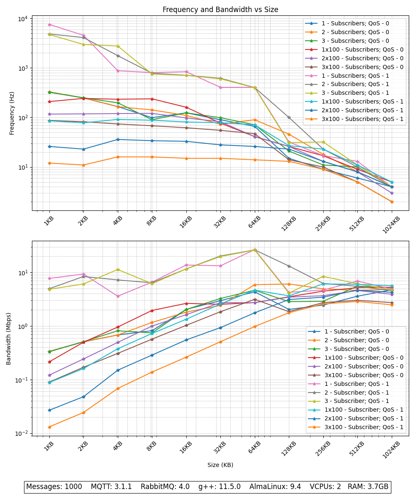

# Visualise results from [MQTT Benchmark](https://github.com/danyk20/MQTT_Benchmark.git)

Current visualization expects data from three different test runs. Each test run has own subfolder inside of `data`
directory which contains all measured values. The first level subfolder name specifies QoS, and the second level name of
the subfolder represents the number of subscribers measured in that test. Inside those subfolders are textfiles (`.txt`)
with arbitrary unique names. Each file represents a single subscriber also called consumer. All those data within one
subfolder will be averaged and plotted on the graph as single line.

## Prerequisites

Run [MQTT Benchmark](https://github.com/danyk20/MQTT_Benchmark.git) to generate data for visualisation/

## Instruction

1. Replace example data with your data inside of `data` folder
- You can add several folders with data and then specify folder by adding path to it as argument when a running script.
- e.g. `python3 show_graph.py data_RabbitMQ`
2. Update `config.py` based on your needs
3. Run the script

```shell
python3 show_graph.py
```

## Output

